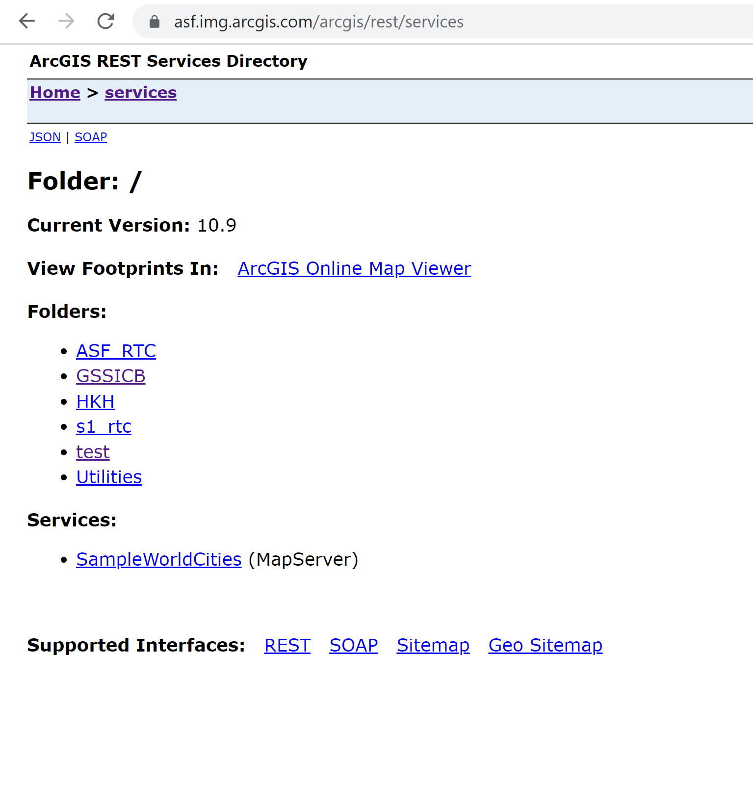
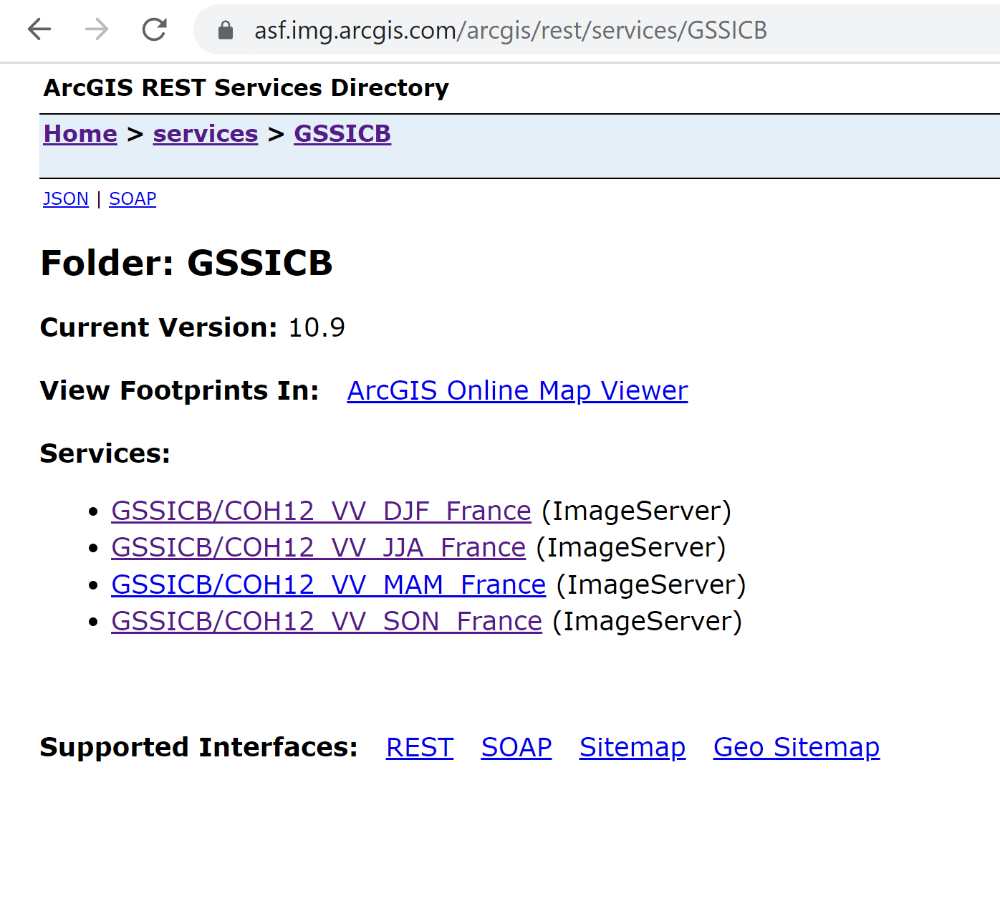
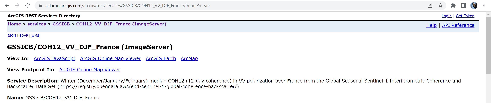
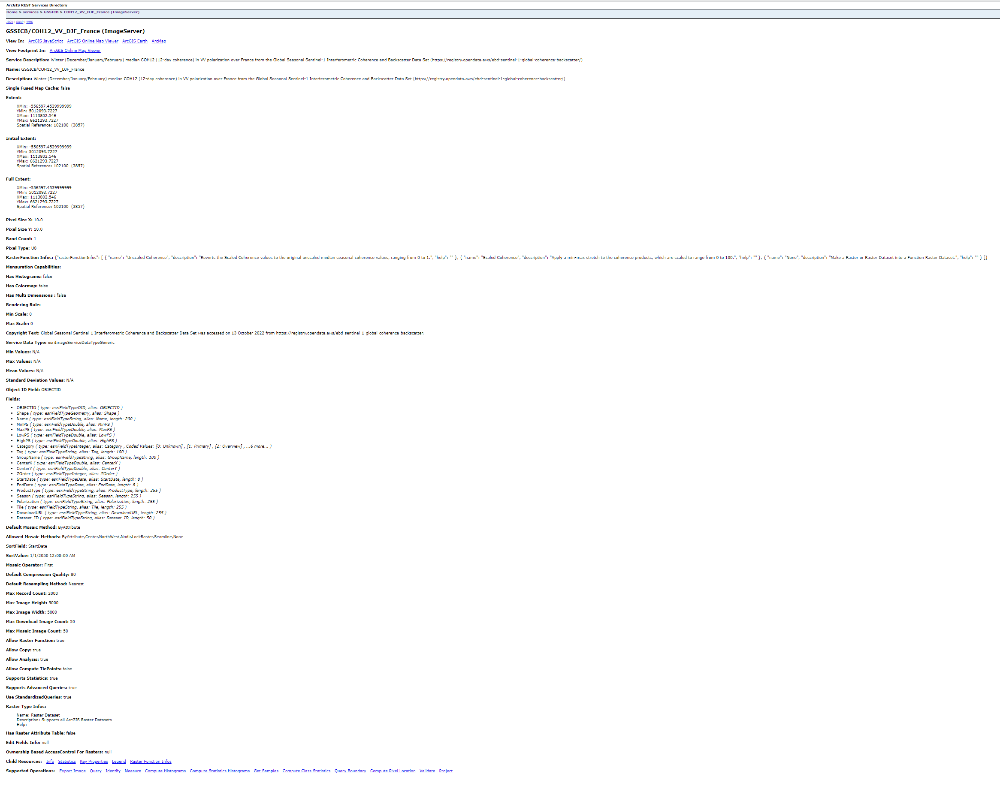
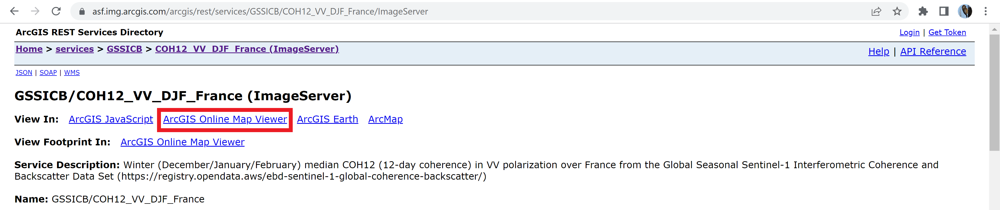
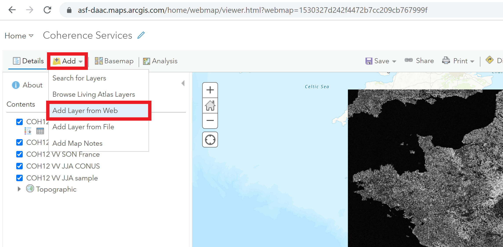
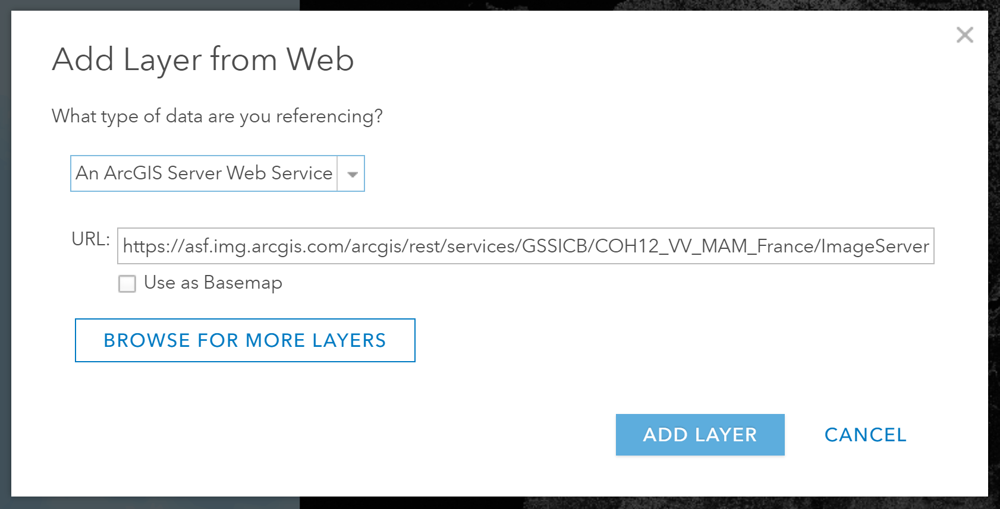
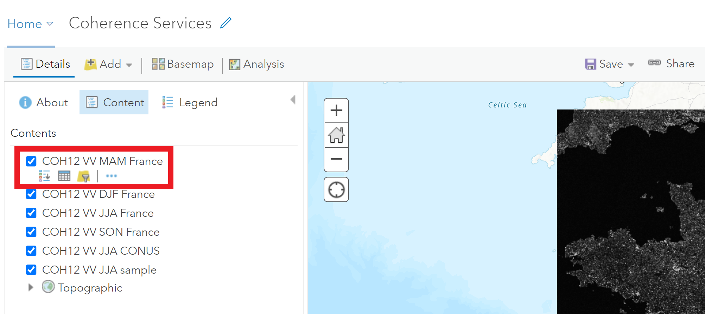

# Add an Image Service to an ArcGIS Web Map

The content published to image servers can be explored in a browser by entering
the URL of the server and adding the path to the services directory. 

For example, to access our ArcGIS Image Dedicated server, use this URL: 

[https://asf.img.arcgis.com/arcgis/rest/services/](https://asf.img.arcgis.com/arcgis/rest/services/)

This page shows a list of all the folders available on the server. Simply click
an item in the list to discover the services contained in that folder.

Once you navigate to a folder, there is a list of the services it contains. 

Click on a service to view the description of that service. The URL for the description page is also the URL used to add this service to web maps.

 

The description page includes the metadata for the service, including a description, 
spatial extent, raster properties, attribute fields, and mosaic dataset properties.

At the top of this description page are "View In" options, including the option
to view in the ArcGIS Online Map Viewer.

Click this link to launch the ArcGIS Online Map Viewer. 

Anyone can view the data in the map viewer, but if you want to save the map,
you will need to log in with ArcGIS credentials. 

## Add an image service to an existing web map

You may want to add multiple services to a web map, or add new services into 
an existing web map. This is easily done using the URL of the REST Endpoint for the 
image service. 

* Open an existing web map
* Click the Add button and select "Add Layer from Web"

* Enter the URL for the image service
    * Set the data type to "An ArcGIS Server Web Service" (this is the default)
    * Enter the image service REST Endpoint in the URL field
    * Click the Add Layer button once it appears in color (it may take a moment for the URL to be validated)
    

The layer is added to the web map. 

## A note on ArcGIS Map Viewers

There are currently two different map viewers available. Esri has been transitioning
from their original Map Viewer (now called Map Viewer Classic) to a Map Viewer Beta
(now called simply Map Viewer). 

While the new Map Viewer has some interesting new features, and is still undergoing 
fairly rapid development, there are some features available in Map Viewer Classic 
that have not yet been integrated into the new Map Viewer.

Until recently, Raster Function Templates (RFT) have not been supported in the new 
Map Viewer. That was a deal-breaker for many of our maps, especially those including
RTC services, which rely on users being able to select from a range of RFTs to 
visualize different polarizations or scales. 

Raster Function Templates are now supported in the new Map Viewer, but there are still
some usage patterns that make it less convenient for users to interact with the image 
services. We can expect improvements here, however, and it may be worth experimenting
with the new Map Viewer to see if it is sufficient for your map application. 

