# Configuring Pop-ups in ArcGIS Online Web Maps

Pop-ups are a key component of a useful AGOL web map. They can be used to interrogate 
and display the pixel values, but can also be configured to display a 
range of attributes and explanatory text. 

Once an image service REST Endpoint has been added to a web map, pop-ups for that layer 
should be enabled and configured before the web map is published publicly.

You will need to be signed in with ArcGIS credentials in order to edit and save 
a web map.

## 1. Enable Pop-ups

- Click on the three dots beneath the layer to open the menu
- Select "Enable Pop-up"

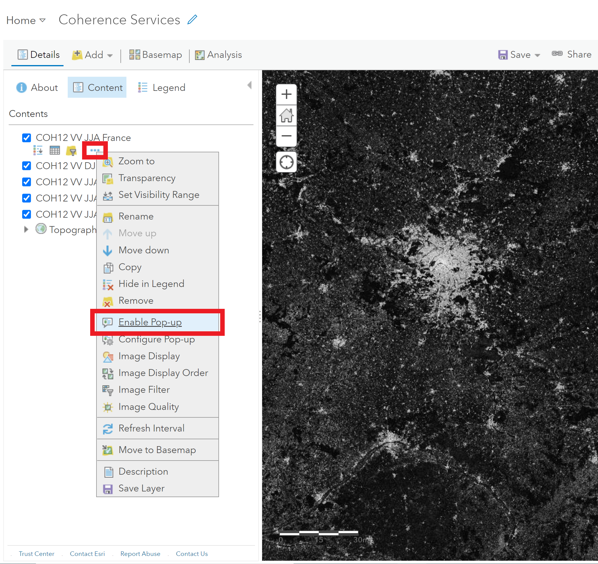


## 2. Configure Popups
- Click on the three dots beneath the layer to open the menu
- Select "Configure Pop-up" to open the Configure Pop-up window

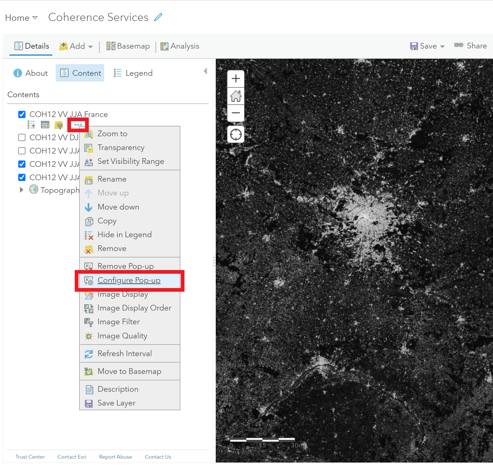


### a. Set Pop-up Title

- Enter something descriptive for the Pop-up title, which will display at the 
  top of the pop-up window
  
- You can dynamically insert the contents of any attribute in the attribute table in 
  the title by using {} around the attribute field name
  
- A combination of static text and dynamic field attributes may be used
  
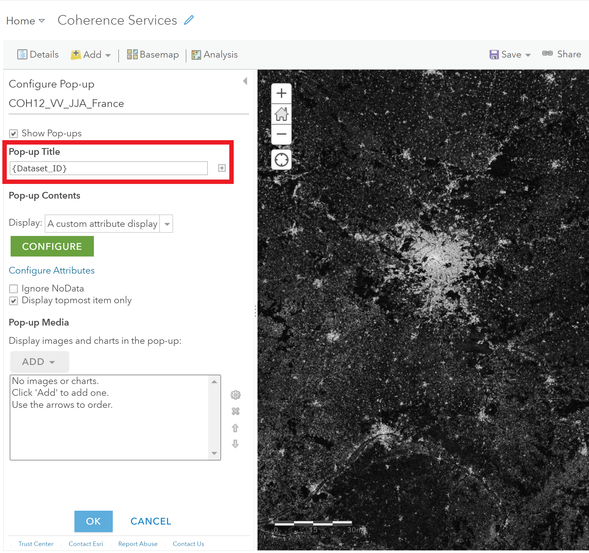

### b. Configure Attributes

- Click on the Configure Attributes link in the Configure Pop-up window

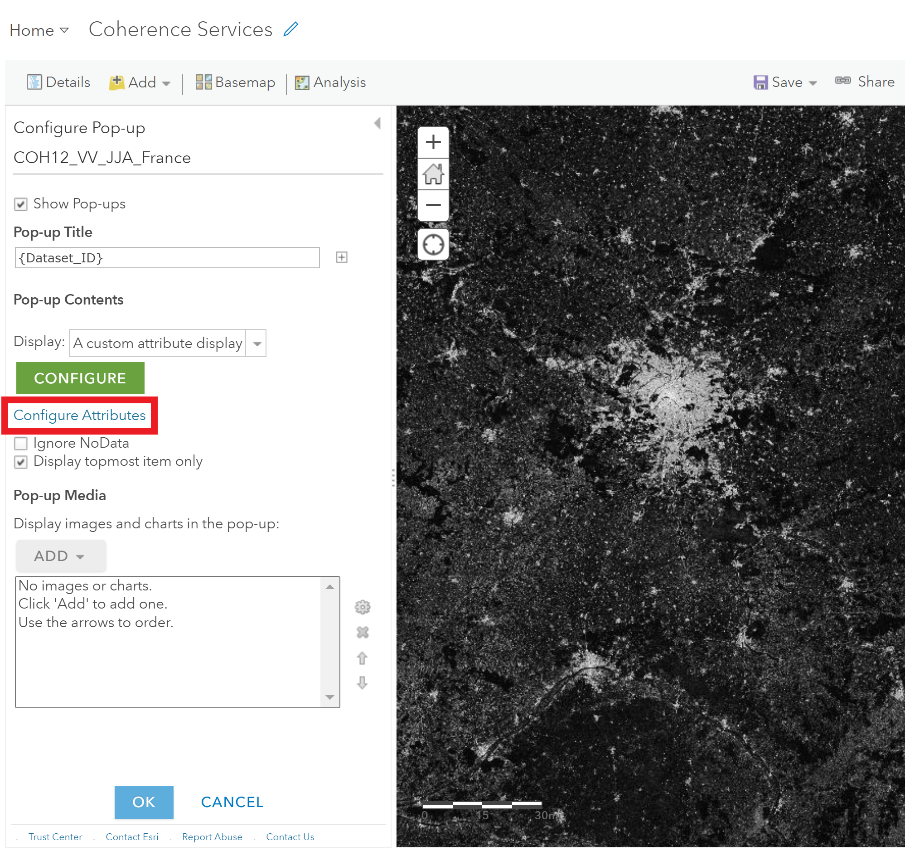

- Click the check box next to "Display" at the top of the window until 
  all attributes are unchecked
  
- Check the box next to the attributes you want to use in the pop-up and/or display 
  in the attribute table by default, and use the arrows to the right of the list 
  to set the order
  
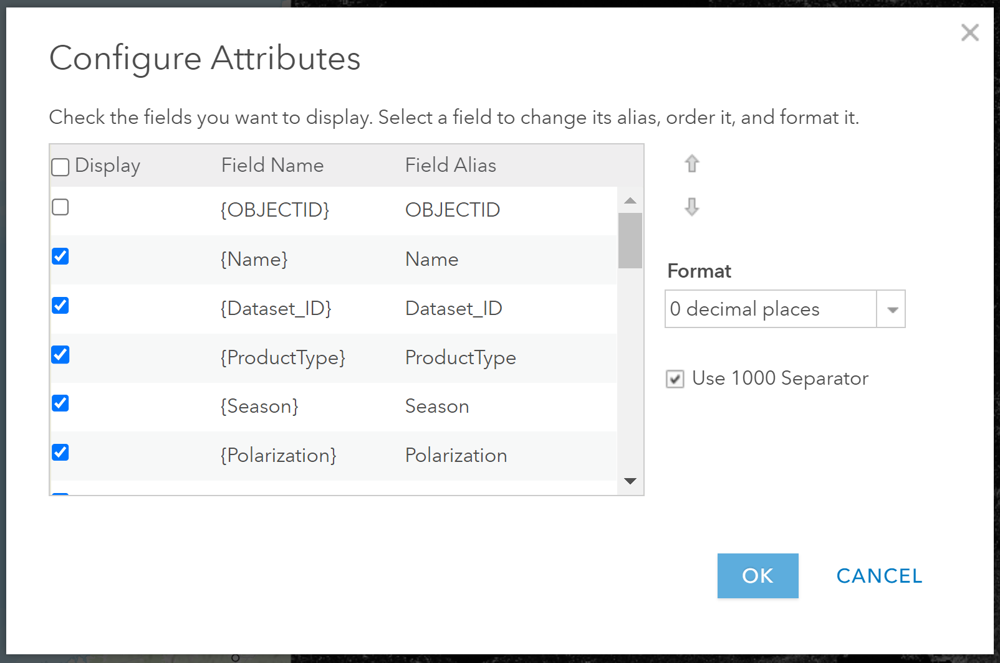

- For numeric fields, you may want to change the format to display 
  a specific number of decimal places
  
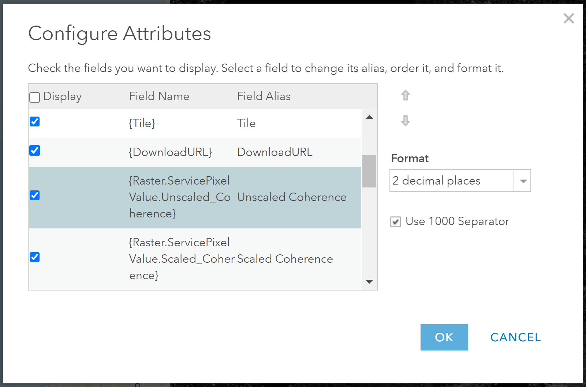

- The Field Alias can be changed as desired if you want to display something other than 
  the default attribute name in the pop-up or attribute table
  
### c. Configure Custom Attribute Display

There is the option to simply display the list of attributes as configured in step 2b, 
but in many cases it's desirable to customize the attribute display to include 
additional text, images, download links, etc. 

If you simply want a list of attributes, select "A list of field attributes" from the
list of display types. This is the default.

To create a more customized pop-up, select the "A custom attribute display" option.

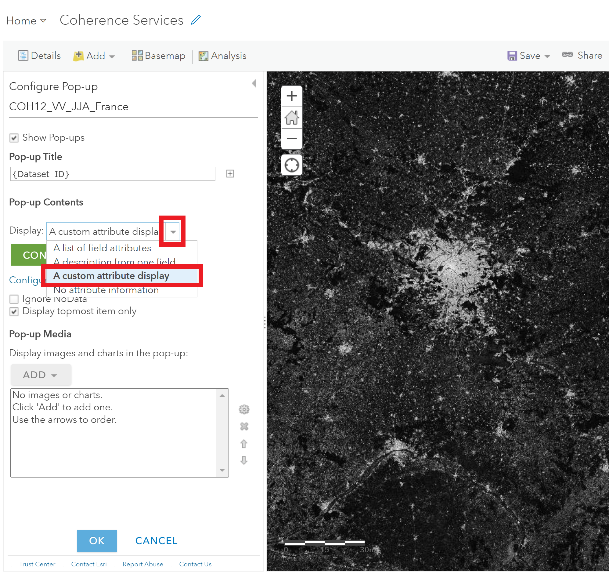

This opens the Custom Attribute Display window, where you can format the pop-ups.

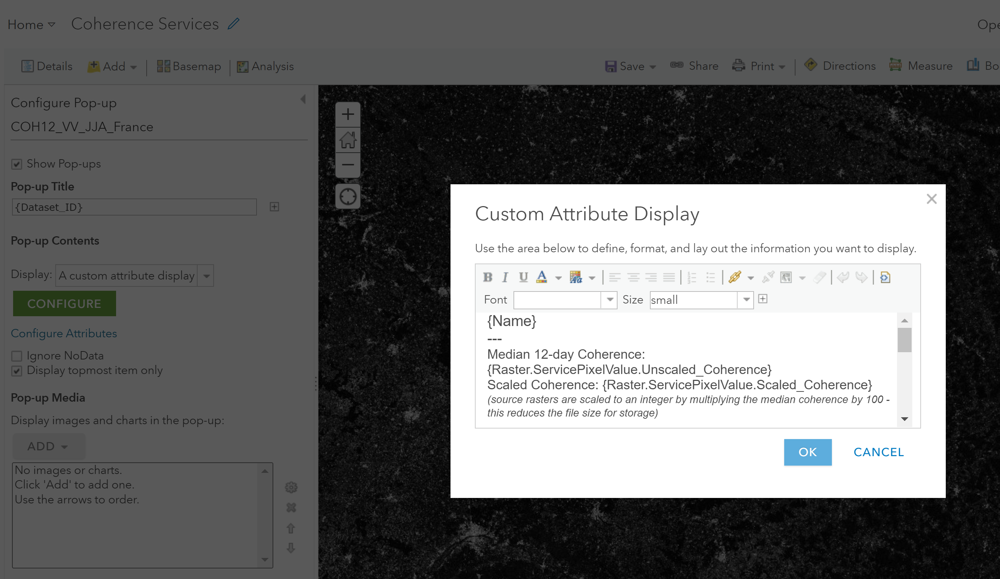

- Use {} with the attribute field names to insert dynamic text
- Use the formatting buttons and drop-down menus to set the font type and size

Sample configuration code:
```
{Name}
--- 
Median 12-day Coherence: {Raster.ServicePixelValue.Unscaled_Coherence}
Scaled Coherence: {Raster.ServicePixelValue.Scaled_Coherence}
(source rasters are scaled to an integer by multiplying the median coherence by 100 - this reduces the file size for storage)
--- 
Product Type: {ProductType}
Season: {Season}
Polarization: {Polarization}
Tile: {Tile}
--- 
Download URL: 
{Name} 
---
This dataset is generated from Sentinel-1 acquisitions for the year ranging from December 1, 2019 to November 20, 2020. 
Sentinel-1 is a C-band SAR mission developed by ESA. This dataset contains modified Copernicus Sentinel data 2019-2020, processed by ESA.
---
The Global Seasonal Sentinel-1 Interferometric Coherence and Backscatter Data Set was developed by Earth Big Data LLC and Gamma Remote Sensing AG, under contract for NASA's Jet Propulsion Laboratory.
```

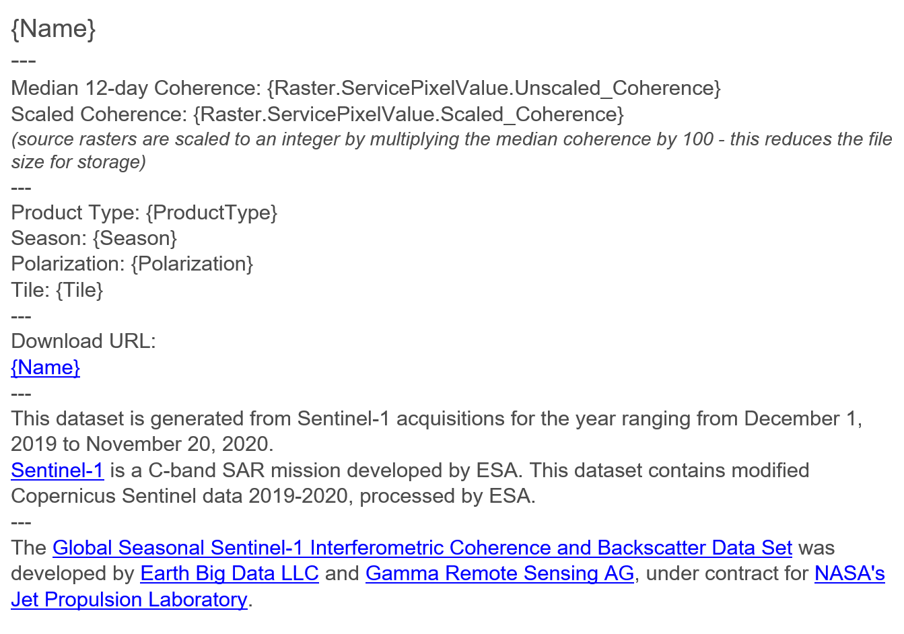

To add in hyperlinks, select the text to serve as the link, then click the link 
button to add a URL.

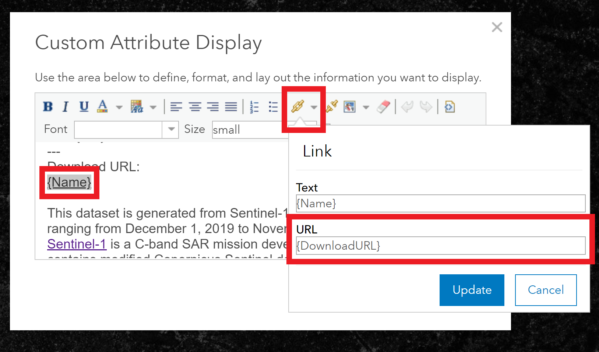

- Dynamic text can be used to populate the URL if it changes from one item to the next 
  in the mosaic dataset
  
- If linking to general information sites, you can just use a static text URL

- If a full URL is not included in the attribute table, you may be able to construct 
  one from a combination of static text and dynamic attribute values:
  
  ```https://sentinel-1-global-coherence-earthbigdata.s3.us-west-2.amazonaws.com/data/tiles/{Tile}/{Name}.tif```

When finished configuring the custom attribute display, click OK to save the changes.

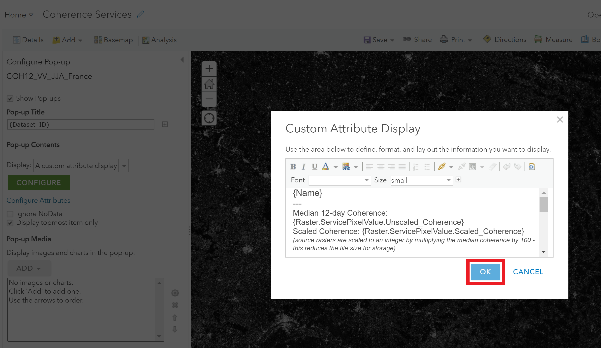

To apply all of the configuration changes, including the Pop-up Title, 
the attribute configuration, and the custom display configuration, 
you **must** click the OK button at the bottom of the panel.

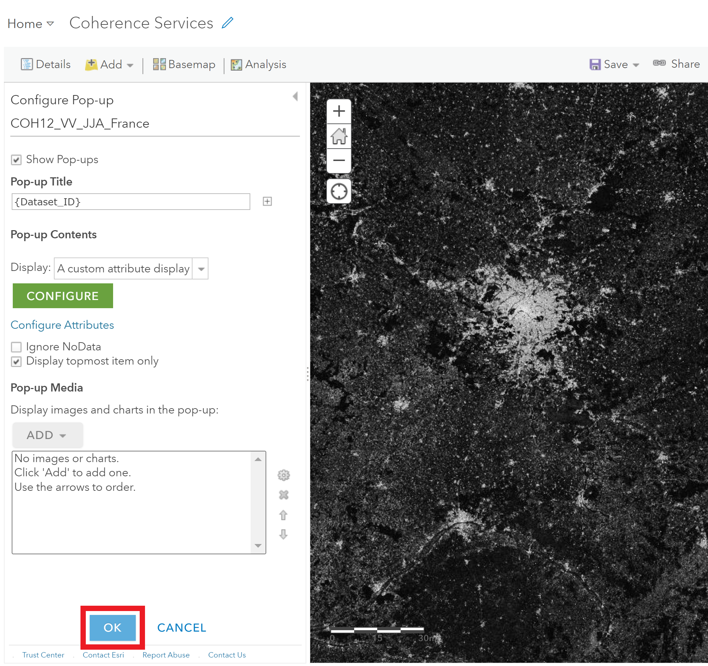

To retain these configurations in the map, you must save it before closing 
or refreshing the page. If the map has already been shared, saving the map 
will make the changes available to all users. If you do not want to change 
the display settings on an existing map, save your map under a different name.


